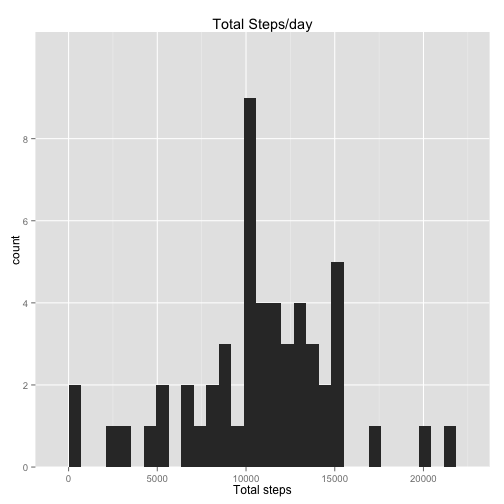
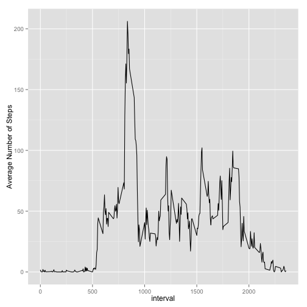
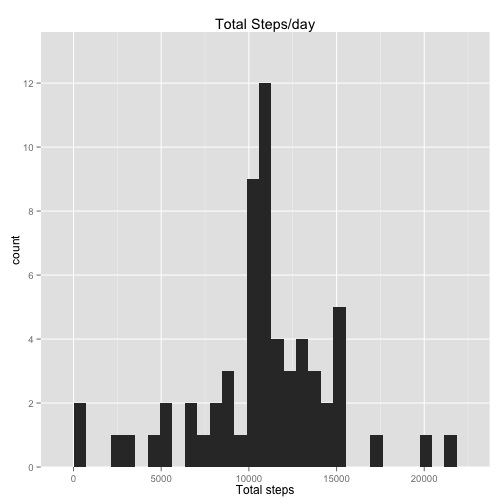
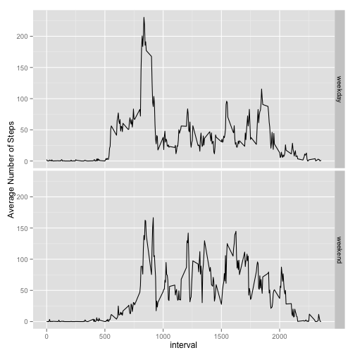

# Reproducible Research: Peer Assessment 1

### Loading required packages

```r
require(ggplot2)
require(reshape2)
```

## Loading and preprocessing the data
The activity data set is loaded by unzipping the activity.zip file present in the working directory. In order to work with date and times, a new column is added to the activity data frame which combines the date and time interval. 


```r
setwd("/Users/sharannarang/Desktop/R projects/Reproducible Research/RepData_PeerAssessment1/")
unzip(zipfile="activity.zip")
activity <- read.csv("activity.csv")
activity$date.time <- strptime(paste(activity$date, formatC(activity$interval, width=4, flag=0)), format="%Y-%m-%d %H%M")
```

## What is mean total number of steps taken per day?

In order to compute the total number of steps per day, a new data frame (activity.na) is created by excluding any rows with NAs in the data frame.

The total across each day is calculated using the tapply function. 


```r
activity.na <- na.exclude(activity)
total.steps <- tapply(activity.na$steps, activity.na$date, sum)
qplot(total.steps, main="Total Steps/day", xlab="Total steps") + scale_y_discrete(breaks=seq(0,12,by=2))
```

 


```r
mean.total <- mean(total.steps,na.rm=T)
median.total <- median(total.steps,na.rm=T)
```

The average total steps taken per day is 1.0766 &times; 10<sup>4</sup>. The median total steps per day is 10765.

## What is the average daily activity pattern?

In order to get average daily activity pattern, the data frame is melted (using the reshape2 package) with steps as the variable and then cast back to compute the mean steps per interval. 


```r
activity.melt <- melt(activity.na, measure.vars=c("steps"))
activity.cast <- dcast(activity.melt, interval~variable,mean)
qplot(data=activity.cast, x=interval, y=steps, geom="line") + ylab("Average Number of Steps")
```

 


```r
max.interval <- activity.cast[activity.cast$steps==max(activity.cast$steps),1]
start.time <- strftime(strptime(formatC(max.interval-5, width=4, flag=0), format="%H%M"), format="%H:%M")
end.time <-strftime(strptime(formatC(max.interval, width=4, flag=0), format="%H%M"), format="%H:%M")
```

The time interval between 08:30 and 08:35 contains the maximum number of steps on average. 

## Imputing missing values

To calculate the total NA values, the is.na function is useful.


```r
na.values <- sum(is.na(activity$steps))
```

The total number of missing values in the acitivity dataset are **2304**.

In order to impute missing values, the mean value of 5 minute interval accross all days is used. The mean value for all intervals was calculated and saved in the acitivity.cast dataframe. For example, if an value for interval 07:55 to 08:00 is missing, it will be imputed using the value for 08:00 from the activity.cast data frame. 


```r
activity.imputed <- activity
for (entry in seq(1,nrow(activity.imputed), by=1)) {
    if (is.na(activity.imputed$steps[entry])) {
        activity.imputed$steps[entry] <- activity.cast[activity.cast$interval==activity.imputed$interval[entry],2]
    }
}
```

Here is a histogram for the total steps per day with the new dataset. 


```r
total.steps.imputed <- tapply(activity.imputed$steps, activity.imputed$date, sum)
qplot(total.steps.imputed, main="Total Steps/day", xlab="Total steps") + scale_y_discrete(breaks=seq(0,12,by=2))
```

 


```r
mean.total.imputed <- mean(total.steps.imputed)
median.total.imputed <- median(total.steps.imputed)
```

The mean total steps per day after imputing mising values is 1.0766 &times; 10<sup>4</sup>. The median total steps per day after imputing missing values is  1.0766 &times; 10<sup>4</sup>.

## Are there differences in activity patterns between weekdays and weekends?

In order to see if there are any differences in activity patterns between weekdays and weekends, a new factor column is added to the data frame. 


```r
activity.imputed$day <- ifelse((weekdays(activity.imputed$date.time)=="Saturday") | (weekdays(activity.imputed$date.time)=="Sunday"),"weekend","weekday")
activity.imputed$day <- as.factor(activity.imputed$day)
```

The melting and casting procedure is used again to reshape the data. The difference in this case is that the casting contains two ids; **interval and day**.   


```r
activity.imputed.melt <- melt(activity.imputed, measure.vars=c("steps"))
activity.imputed.cast <- dcast(activity.imputed.melt, interval+day~variable,mean)
qplot(data=activity.imputed.cast, x=interval, y=steps, facets=day~., geom="line") + ylab("Average Number of Steps")
```

 

It is noticible that the subject had more steps on **weekday mornings** than weekend mornings with peak being around 08:30 on the weekdays. On average, the subject had more steps on weekend afternoons than weekday afternoons. 
